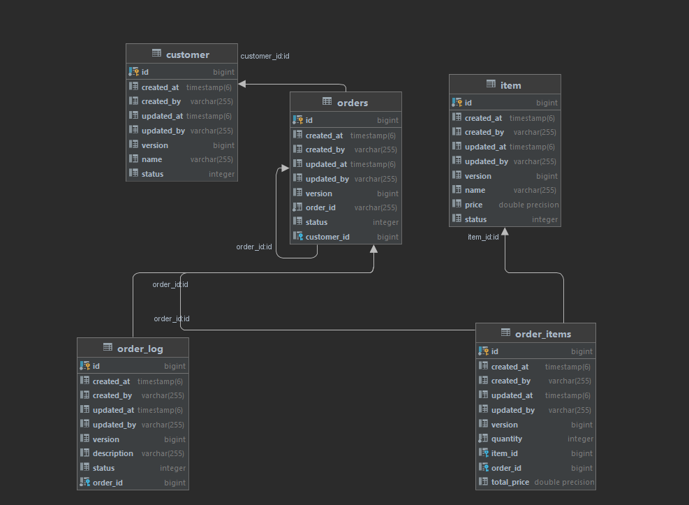

## Restaurant-app

This project has 3 services. `Customer Service` ,  `Food Service` and `Order Service`
_Customer Service_ is responsible for creating customer and publish an event to `customer` kafka topic . Then this event is processed by 
_order service_ and a minimal copy of customer is persisted in it's own database order-db.

Same thing for food service. Food item created and publish an event of food creation and this food is then replicated to order service.

Main service is Order-service.
Here an order is created with a customer and Food item list with quantity.
This Order creation is in `Pending` State and create an event order topic.

Then order is processed for total bill and then the order is transferred into `wait_for_payment` state.
After, bill payment this order is in `Placed` state

This is a very simple `microservice` based application which can be enhanced to more complex featured application.

1. ### **customer-service**:
   Swagger api doc: http://localhost:8010/customer-service/swagger-ui/index.html

   1. Customer List API: [GET] /api/customer?page=0&pageSize=5
   2. Customer Create Api: [POST] /api/customer
   

2. ### **Food-service**:
   Swagger api doc: http://localhost:8011/food-service/swagger-ui/index.html#/item-controller/createItem
   1. Create Food API: [POST] /api/item

3. ### **Order-service**:
DB Design:

### Project start-up instruction:
1. After Gradle dependency fetch, 
   run `.\CleanBuildAllServices.bat`
   This command will build all projects.
2. run docker compose up
        or 
   run `docker compose up -d `

Hurrah! You are all set.
Now test the project using `swagger` or `postman`
